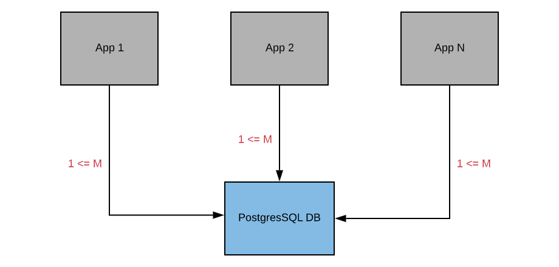
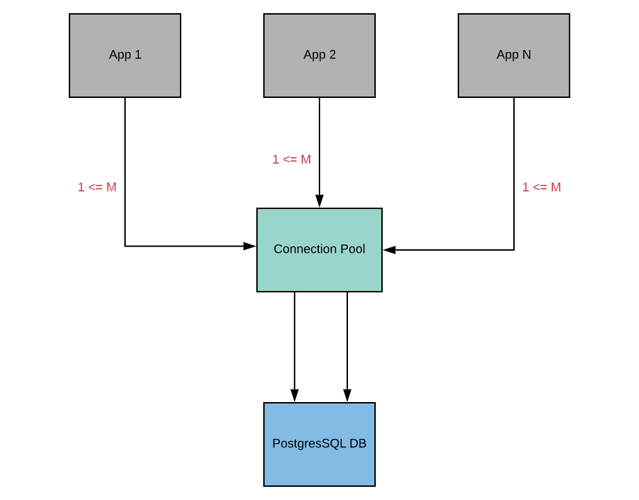

# PgBouncer Docker Image and Helm Chart

Using connection pooling, we can have multiple client-side connections reusing PostgreSQL connections. Connection pooling acts as middleware between a Postgres server and the application by maintaining a sophisticated connection pools to the server. 

This project provides Alpine and Debian Docker files which can be used to spin-up pgbouncer, a PostgreSQL connection pooler, in Docker and Kubernetes environments. 

## Overview

Database connections to PostgreSQL from microservices can become unpredictable at peak times. From our experience of running microservices at scale, apps often fail to connect to PostgreSQL and at other times, database resources are usually under pressure yet there is no significant load on the system. Time to execute queries was unusually high, sometimes in the margins of over 5 seconds for simple queries. These issues occured intermittently and were often not easily reproducible in the test environment. 

Documentation of most ORM frameworks tells developers to insert database connection strings in a settings or config file. Such a setup results in your apps or microservices directly connecting to PostgreSQL. For instance, [Django] (https://www.djangoproject.com/) recommends connection to PostgreSQL [here] (https://docs.djangoproject.com/en/3.0/ref/settings/), with a typical example configuration like: 

```
DATABASES = {
    'default': {
        'ENGINE': 'django.db.backends.postgresql',
        'NAME': 'mydatabase',
        'USER': 'mydatabaseuser',
        'PASSWORD': 'mypassword',
        'HOST': '127.0.0.1',
        'PORT': '5432',
    }
}
```

Such a setup can be illustrated using the following diagram:



By pooling connections we can have multiple client-side connections reuse PostgreSQL connections. For example, without pooling we'd need at lease M*N PostgreSQL connections to handle N microservices with M being the highest number of connections in one of the services. With connection pooling, we may only need 5 or so PostgreSQL connections depending on our configuration. This means our connection diagram will instead look something like the following:



## Installation

## Benchmarks

100 subsequent `SELECT 1` queries  with and without PgBouncer

```bash
root@testpod:/# ./test.sh
Running 100 queries directly against aws rds postgresql server

real    2m15.000s
user    0m5.090s
sys     0m1.874s

Running 100 queries through PgBouncer

real    0m5.330s
user    0m3.690s
sys     0m1.014s

root@testpod:/#
```